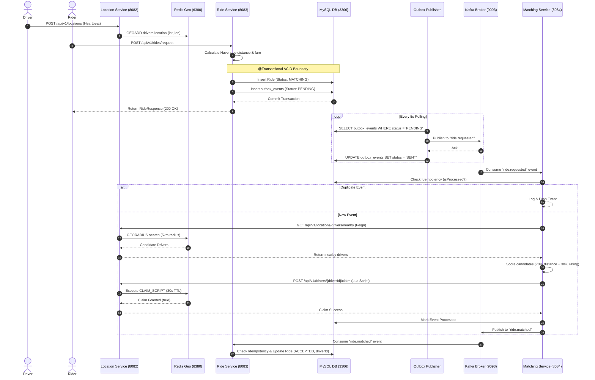

# 🧠 Cab-Driving Microservices Platform — System Mind Map & Architecture Model

> **Overview:** A comprehensive architectural mind map documenting everything happening in the codebase, including microservice boundaries, data stores, event streams, mathematical algorithms, and the distributed systems problems encountered and solved across the platform evolution (v0.1 → v0.6).

---

## 🗺️ Visual System Mind Map (Mermaid)

```mermaid
mindmap
  root((🚕 Cab-Driving Platform))
    🏗️ Microservices Architecture
      Ride Service :8083
        ::icon(fa fa-server)
        MySQL Database uberapp
        Ride Entity Persistence
        Outbox Event Storage
        State Machine Validation
      Location Service :8082
        ::icon(fa fa-location-dot)
        Redis Geo Index drivers:location
        Atomic Driver Claiming
        Stale Release Protection
        Nearby Driver Radius Search
      Matching Service :8084
        ::icon(fa fa-cogs)
        Stateless Processing
        Feign REST Client to Location
        Weighted Candidate Scoring
        Idempotent Kafka Consumer
    ⚡ Infrastructure & Data Stores
      MySQL :3306
        rides Table
        outbox_events Table
        Processed Event Tables
      Redis host :6380 → container :6379
        drivers:location Geo Sorted Set
        driver:claim:{driverId} 30s TTL
        ride:claim:{rideId} 30s TTL
      Kafka host :9093 → container :9092
        ride.requested Topic
        ride.matched Topic
        ride.requested-dlt Dead Letter Topic
      Zookeeper host :2182 → container :2181
    📐 Algorithms & Logic
      Haversine Formula
        6371km Earth Radius
        Lat/Long Coordinate Distance
      Fare Calculation
        Base Fare ₹50
        Distance Rate ₹12/km
      Driver Scoring
        70% Proximity Weight
        30% Rating Weight
      Geo Radius Search
        Redis GEORADIUS / GEOSEARCH
    ⚠️ Problems Encountered & Tackled
      Dual-Write Inconsistency v0.2
        Problem: DB saved but Kafka publish failed
        Solution: Transactional Outbox Pattern
      Consumer Failure & Poison Pills v0.3
        Problem: Infinite retry loops or app crash
        Solution: ErrorHandlingDeserializer + Exponential Backoff + DLT
      Duplicate Kafka Messages v0.4
        Problem: At-least-once delivery side-effects
        Solution: DB-backed Idempotent Event Consumer
      Race Conditions / Double Booking v0.5
        Problem: Concurrent rides claiming same driver
        Solution: Redis Lua Script Atomic Claiming + 30s TTL
      State Machine Chaos v0.6
        Problem: Direct state skips or terminal edits
        Solution: Strict RideStateTransitionValidator + DRIVER_ARRIVING
```

---

## 🔀 Distributed System Problems vs. Tackled Solutions

```mermaid
graph TD
    subgraph P1["Problem 1: Dual-Write Failures (v0.2)"]
        A1["Ride saved to MySQL, but Kafka publish fails"] -->|Tackled with| S1["Transactional Outbox Pattern<br/>(outbox_events table + Scheduled OutboxPublisher)"]
    end

    subgraph P2["Problem 2: Poison Messages & Network Jitter (v0.3)"]
        A2["Malformed JSON or temporary DB locks cause consumer crashes"] -->|Tackled with| S2["Retry & Dead Letter Topic (DLT)<br/>(Exponential Backoff 1s/2s/4s -> ride.requested-dlt)"]
    end

    subgraph P3["Problem 3: Duplicate Event Processing (v0.4)"]
        A3["Kafka at-least-once delivery causes duplicate driver assignments"] -->|Tackled with| S3["Idempotent Event Processing<br/>(ProcessedEvent table in MySQL + IdempotencyService)"]
    end

    subgraph P4["Problem 4: Concurrent Driver Double-Booking (v0.5)"]
        A4["Multiple matching threads select same driver simultaneously"] -->|Tackled with| S4["Atomic Driver Claiming<br/>(Redis Lua Script + 30s TTL + Stale Release Guard)"]
    end

    subgraph P5["Problem 5: Lifecycle Chaos & Skips (v0.6)"]
        A5["Direct skips (REQUESTED -> COMPLETED) or mutations after cancellation"] -->|Tackled with| S5["Strict State Machine<br/>(RideStateTransitionValidator + DRIVER_ARRIVING step)"]
    end
```



---

## 🏛️ Comprehensive Architecture & Service Breakdown

### 1. [`ride-service`](file:///c:/Users/amank/Desktop/cab-driving/ride-service) (Port: `8083`)
* **Primary Responsibility:** Manages ride lifecycle, persistence, outbox event generation, and fare calculations.
* **Database:** MySQL database `uberapp` (`rides`, `outbox_events`, `Matched_processed_events`).
* **Key Components:**
  * [`RideService.java`](file:///c:/Users/amank/Desktop/cab-driving/ride-service/src/main/java/com/rideshare/rideservice/service/RideService.java): Handles ride creation, state transitions, fare calculation.
  * [`OutboxPublisher.java`](file:///c:/Users/amank/Desktop/cab-driving/ride-service/src/main/java/com/rideshare/rideservice/service/OutboxPublisher.java): Background `@Scheduled` job polling `outbox_events` and pushing to `ride.requested`.
  * [`RideStateTransitionValidator.java`](file:///c:/Users/amank/Desktop/cab-driving/ride-service/src/main/java/com/rideshare/rideservice/service/RideStateTransitionValidator.java): Validates allowed state transitions.
  * [`RideEventConsumer.java`](file:///c:/Users/amank/Desktop/cab-driving/ride-service/src/main/java/com/rideshare/rideservice/service/RideEventConsumer.java): Idempotent consumer for `ride.matched`.
  * [`IdempotencyService.java`](file:///c:/Users/amank/Desktop/cab-driving/ride-service/src/main/java/com/rideshare/rideservice/service/IdempotencyService.java): Deduplicates incoming Kafka messages.

### 2. [`matching-service`](file:///c:/Users/amank/Desktop/cab-driving/matching-service) (Port: `8084`)
* **Primary Responsibility:** Discovers nearby drivers, scores candidates, claims drivers, and emits match events.
* **Database:** Stateless application logic; persists `Requested_processed_events` in MySQL for idempotency.
* **Key Components:**
  * [`RideEventConsumer.java`](file:///c:/Users/amank/Desktop/cab-driving/matching-service/src/main/java/com/rideshare/matchingservice/service/RideEventConsumer.java): Consumes `ride.requested` with Spring Kafka retry & DLT recovery.
  * [`MatchingService.java`](file:///c:/Users/amank/Desktop/cab-driving/matching-service/src/main/java/com/rideshare/matchingservice/service/MatchingService.java): Requests nearby drivers via Feign, scores candidates ($70\%$ proximity + $30\%$ rating), claims driver atomically.
  * [`KafkaConsumerConfig.java`](file:///c:/Users/amank/Desktop/cab-driving/matching-service/src/main/java/com/rideshare/matchingservice/config/KafkaConsumerConfig.java): Configures `ErrorHandlingDeserializer`, `ExponentialBackOffWithMaxRetries` (3 attempts), and `DeadLetterPublishingRecoverer`.

### 3. [`location-service`](file:///c:/Users/amank/Desktop/cab-driving/location-service) (Port: `8082`)
* **Primary Responsibility:** Manages driver GPS coordinates, fast spatial queries, and atomic driver reservations.
* **Data Store:** Redis Geospatial Indexing (`drivers:location`) & String keys for atomic claims (`driver:claim:{id}`, `ride:claim:{id}`).
* **Key Components:**
  * [`LocationService.java`](file:///c:/Users/amank/Desktop/cab-driving/location-service/src/main/java/com/rideshare/locationservice/service/LocationService.java): Handles location heartbeats (`GEOADD`) and radius searches (`GEORADIUS`/`GEOSEARCH`).
  * [`DriverClaimService.java`](file:///c:/Users/amank/Desktop/cab-driving/location-service/src/main/java/com/rideshare/locationservice/service/DriverClaimService.java): Executes Lua scripts for atomic driver reservation and stale release verification.
  * [`DriverClaimController.java`](file:///c:/Users/amank/Desktop/cab-driving/location-service/src/main/java/com/rideshare/locationservice/controller/DriverClaimController.java): REST endpoints for claim/release.

---

## 🧮 Core System Algorithms

### 1. Haversine Distance Formula
Calculates the great-circle distance between pickup $(\phi_1, \lambda_1)$ and drop $(\phi_2, \lambda_2)$ points on Earth:
$$a = \sin^2\left(\frac{\Delta\phi}{2}\right) + \cos(\phi_1) \cdot \cos(\phi_2) \cdot \sin^2\left(\frac{\Delta\lambda}{2}\right)$$
$$c = 2 \cdot \arcsin(\sqrt{a})$$
$$\text{Distance} = R \cdot c \quad (R = 6371\text{ km})$$

### 2. Ride Fare Estimation
$$\text{Estimated Fare} = ₹50 + (\text{Distance in km} \times ₹12)$$

### 3. Weighted Driver Scoring
$$\text{DistanceScore} = \frac{1}{\text{distanceInKm} + 0.1}$$
$$\text{TotalScore} = (\text{DistanceScore} \times 0.7) + (\text{DriverRating} \times 0.3)$$

---

## 🛠️ Detailed Evolutionary Problems & Technical Solutions

### 1. Dual-Write Inconsistency (v0.2)
* **The Problem:** Saving ride details to MySQL and directly invoking `KafkaTemplate.send()` creates a dual-write vulnerability. If Kafka fails after the database commit, the ride remains stuck in `REQUESTED` status.
* **The Solution:** Implemented the **Transactional Outbox Pattern**. Ride entity insertion and outbox event creation (`outbox_events` table) occur within the same `@Transactional` database boundary. A background `@Scheduled(fixedDelay = 5000)` poller in [`OutboxPublisher.java`](file:///c:/Users/amank/Desktop/cab-driving/ride-service/src/main/java/com/rideshare/rideservice/service/OutboxPublisher.java) reads `PENDING` outbox records, publishes them to Kafka, and marks them `SENT`.

### 2. Transient Failures, Poison Pills & DLT (v0.3)
* **The Problem:** Consumer errors due to network hiccups or unparseable JSON ("poison pills") can lock partitions or crash consumers.
* **The Solution:** Standardized on `ErrorHandlingDeserializer` and configured Spring Kafka's `DefaultErrorHandler` in [`KafkaConsumerConfig.java`](file:///c:/Users/amank/Desktop/cab-driving/matching-service/src/main/java/com/rideshare/matchingservice/config/KafkaConsumerConfig.java). Transient errors are retried up to 3 times using exponential backoff (1s $\rightarrow$ 2s $\rightarrow$ 4s). Poison pills or exhausted retries are published to `ride.requested-dlt` via `DeadLetterPublishingRecoverer`.

### 3. Consumer Idempotency (v0.4)
* **The Problem:** Kafka's at-least-once delivery can trigger duplicate `ride.requested` or `ride.matched` processing.
* **The Solution:** Developed database-backed [`IdempotencyService.java`](file:///c:/Users/amank/Desktop/cab-driving/matching-service/src/main/java/com/rideshare/matchingservice/service/IdempotencyService.java). Before running business logic, consumers query `isProcessed(rideId)`. If `true`, the event is skipped. If `false`, the event is processed and marked in `Requested_processed_events` or `Matched_processed_events`.

### 4. Atomic Driver Claiming & Stale Release (v0.5)
* **The Problem:** High request volume causes concurrent matching workers to select and claim the same driver.
* **The Solution:** Created atomic Lua scripts executed by Redis in [`DriverClaimService.java`](file:///c:/Users/amank/Desktop/cab-driving/location-service/src/main/java/com/rideshare/locationservice/service/DriverClaimService.java). Sets dual Redis keys `driver:claim:{driverId}` and `ride:claim:{rideId}` with a 30-second TTL. If a claim is released, the caller's `rideId` must match the key value to prevent accidental release of a newer reservation.

### 5. Strict Lifecycle State Machine (v0.6)
* **The Problem:** Direct skipped state transitions or mutations on completed/cancelled rides violate business domain rules.
* **The Solution:** Implemented [`RideStateTransitionValidator.java`](file:///c:/Users/amank/Desktop/cab-driving/ride-service/src/main/java/com/rideshare/rideservice/service/RideStateTransitionValidator.java) to validate state movements (`REQUESTED` $\rightarrow$ `MATCHING` $\rightarrow$ `ACCEPTED` $\rightarrow$ `DRIVER_ARRIVING` $\rightarrow$ `RIDE_STARTED` $\rightarrow$ `COMPLETED`). Any invalid skip or attempt to mutate terminal states (`COMPLETED`, `CANCELLED`) throws an immediate `IllegalStateException`.

---

## 🔄 End-to-End Ride Request Execution Flow



---

## 📄 References & Engineering Documentation Index

- 📘 [ARCHITECTURE.md](file:///c:/Users/amank/Desktop/cab-driving/ARCHITECTURE.md): Platform System Architecture & Deep-Dive
- 📜 [INITIAL_MICROSERVICES_V01.md](file:///c:/Users/amank/Desktop/cab-driving/docs/engineering/INITIAL_MICROSERVICES_V01.md): Initial Microservices Setup (v0.1)
- 📜 [TRANSACTIONAL_OUTBOX_V02.md](file:///c:/Users/amank/Desktop/cab-driving/docs/engineering/TRANSACTIONAL_OUTBOX_V02.md): Transactional Outbox Implementation (v0.2)
- 📜 [RETRY_AND_DLT_DOCUMENTATION_V03.md](file:///c:/Users/amank/Desktop/cab-driving/docs/engineering/RETRY_AND_DLT_DOCUMENTATION_V03.md): Consumer Retries & DLT Architecture (v0.3)
- 📜 [IDEMPOTENT_EVENT_PROCESSING_V04.md](file:///c:/Users/amank/Desktop/cab-driving/docs/engineering/IDEMPOTENT_EVENT_PROCESSING_V04.md): Idempotent Event Processing (v0.4)
- 📜 [ATOMIC_DRIVER_CLAIMING_V05.md](file:///c:/Users/amank/Desktop/cab-driving/docs/engineering/ATOMIC_DRIVER_CLAIMING_V05.md): Atomic Driver Claiming & Stale Release (v0.5)
- 📜 [RIDE_STATE_MACHINE_V06.md](file:///c:/Users/amank/Desktop/cab-driving/docs/engineering/RIDE_STATE_MACHINE_V06.md): Strict Ride Lifecycle State Machine (v0.6)
