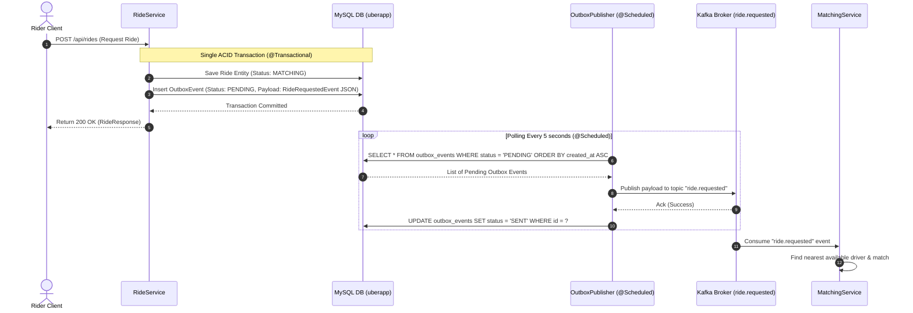

# Transactional Outbox Pattern Implementation

This document details the **Transactional Outbox Pattern** implemented in the `ride-service` microservice to guarantee reliable, event-driven communication between `ride-service` and `matching-service` via Apache Kafka.

---

## 1. Problem Statement: The Dual-Write Problem

Prior to implementing the Transactional Outbox pattern, `RideService` executed a dual-write process when a rider requested a cab:
1. Save the new `Ride` entity into the MySQL database.
2. Immediately publish a `RideRequestedEvent` to Apache Kafka using `KafkaTemplate`.

```
[ Rider Request ] ──► [ RideService ] ──┬──► (1) Save to MySQL DB
                                       └──► (2) Publish to Kafka (Network call)
```

### Risk of Failures:
- **Inconsistency**: If the database transaction commits successfully but the application crashes or Kafka is temporarily unavailable during the network call, the `Ride` is created in MySQL, but no Kafka event is ever published. `matching-service` never receives the ride request, leaving the ride stuck in `REQUESTED` / `MATCHING` status forever.
- **Distributed State Corruption**: Database state and event broker state drift out of sync.

---

## 2. Solution Architecture: Transactional Outbox

The **Transactional Outbox Pattern** solves the dual-write problem by replacing the immediate network call to Kafka with a database write within the **same atomic database transaction (`@Transactional`)**.

### Workflow Architecture:



---

## 3. Database Schema: `outbox_events` Table

Outbox events are stored in the database table `outbox_events` managed by JPA Hibernate.

| Column | Type | Description |
| :--- | :--- | :--- |
| `id` | `BIGINT AUTO_INCREMENT` (PK) | Unique primary key ID for the event |
| `topic` | `VARCHAR(255)` | Target Kafka topic (e.g., `ride.requested`) |
| `event_type` | `VARCHAR(255)` | Type of event (e.g., `RIDE_REQUESTED`) |
| `aggregate_id` | `VARCHAR(255)` | ID of the aggregate root (e.g., `savedRide.getId()`) |
| `payload` | `TEXT` | JSON serialized payload of the event (`RideRequestedEvent`) |
| `status` | `VARCHAR(255)` | Current publishing status (`PENDING`, `SENT`, `FAILED`) |
| `created_at` | `DATETIME(6)` | Timestamp when outbox record was created |

---

## 4. Key Components Implemented

### 4.1 Outbox Event Entity
- **File**: [`OutboxEvent.java`](../../ride-service/src/main/java/com/rideshare/rideservice/event/OutboxEvent.java)
- JPA Entity mapped to `@Table(name = "outbox_events")` representing individual outbox entries.

### 4.2 Outbox Repository
- **File**: [`OutboxEventRepository.java`](../../ride-service/src/main/java/com/rideshare/rideservice/repository/OutboxEventRepository.java)
- Defines JPA query method `findByStatusOrderByCreatedAtAsc("PENDING")` to retrieve pending events sequentially by creation timestamp.

### 4.3 Atomic Ride & Outbox Event Creation
- **File**: [`RideService.java`](../../ride-service/src/main/java/com/rideshare/rideservice/service/RideService.java)
- Method `requestRide(RideRequest request)` is annotated with `@Transactional`.
- Serializes `RideRequestedEvent` into JSON using `ObjectMapper` and writes the `OutboxEvent` inside `createOutboxEvent(savedRide)`.

```java
@Transactional
public RideResponse requestRide(RideRequest request) {
    // 1. Save ride to database
    Ride savedRide = MapToRide(request);
    savedRide.setStatus(RideStatus.MATCHING);
    rideRepository.save(savedRide);

    // 2. Write outbox event in the SAME transaction
    createOutboxEvent(savedRide);

    return mapToResponse(savedRide);
}
```

### 4.4 Outbox Publisher (Background Scheduler)
- **File**: [`OutboxPublisher.java`](../../ride-service/src/main/java/com/rideshare/rideservice/service/OutboxPublisher.java)
- Runs a background worker using Spring's `@Scheduled(fixedDelay = 5000)`.
- Fetches all `PENDING` outbox events, dispatches them asynchronously via `KafkaTemplate`, and upon successful acknowledgment, updates status to `SENT`.

```java
@Scheduled(fixedDelay = 5000)
public void publishPendingEvents() {
    List<OutboxEvent> events = outboxEventRepository.findByStatusOrderByCreatedAtAsc("PENDING");
    for (OutboxEvent event : events) {
        publishEvent(event);
    }
}
```

### 4.5 Enabling Scheduling
- **File**: [`RideServiceApplication.java`](../../ride-service/src/main/java/com/rideshare/rideservice/RideServiceApplication.java)
- Added `@EnableScheduling` to activate background scheduling in the Spring container.

### 4.6 Jackson JSON Serializer Configuration
- **Files**: 
  - [`ride-service/src/main/resources/application.properties`](../../ride-service/src/main/resources/application.properties)
  - [`matching-service/src/main/resources/application.properties`](../../matching-service/src/main/resources/application.properties)
- Updated Kafka producer and consumer configurations to use `JacksonJsonSerializer` and `JacksonJsonDeserializer`.

---

## 5. Benefits & Guarantees

1. **At-Least-Once Delivery**: Outbox events remain stored in MySQL until Kafka explicitly acknowledges reception. Even if Kafka goes down or the application restarts, pending events are retried on the next polling iteration.
2. **Transactional Guarantees (ACID)**: Ride creation and event persistence are committed together in MySQL. If the ride creation fails or rolls back, no outbox event is produced.
3. **High Availability**: The API response to the rider client (`POST /api/rides`) does not block on Kafka cluster latency or network connectivity issues.

---

## 6. How to Verify & Test

1. **Inspect MySQL Outbox Records**:
   ```sql
   USE uberapp;
   SELECT id, topic, event_type, aggregate_id, status, created_at FROM outbox_events;
   ```
2. **Check Status Transitions**:
   - Immediately after calling `POST /api/rides`, check `outbox_events` table -> `status` will temporarily show `PENDING`.
   - Within 5 seconds (poller interval), status will transition to `SENT`.
3. **Application Logs**:
   Look for the following log output in `ride-service`:
   ```
   INFO com.rideshare.rideservice.service.OutboxPublisher - Outbox event 1 published successfully
   ```
